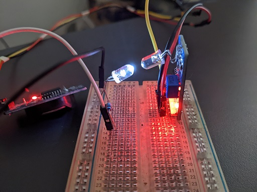

Pulse LED
=========

A simple Arduinoo sketch to simulate the Pulse LED, found on some Electricity Power Meters.

The parameters are set in the code. It can do fixed power consumption or randomized.

Components
----------

* A White LED (other colours might work).
* A 330Ω resistor (or anything from 220 to 1k).
* A ESP board (I'd recommend ESP32 over an ESP8266, but the latter might work for you.)

Assets
------
Here's a picture of the test-bed I used to test the accuracy of the Power Meter.

